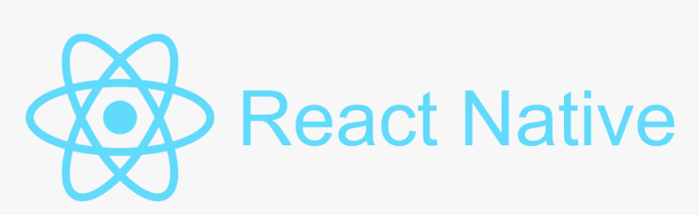
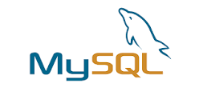

<!-- Improved compatibility of back to top link: See: https://github.com/othneildrew/Best-README-Template/pull/73 -->

<!--
*** Thanks for checking out the Best-README-Template. If you have a suggestion
*** that would make this better, please fork the repo and create a pull request
*** or simply open an issue with the tag "enhancement".
*** Don't forget to give the project a star!
*** Thanks again! Now go create something AMAZING! :D
-->

<!-- PROJECT SHIELDS -->
<!--
*** I'm using markdown "reference style" links for readability.
*** Reference links are enclosed in brackets [ ] instead of parentheses ( ).
*** See the bottom of this document for the declaration of the reference variables
*** for contributors-url, forks-url, etc. This is an optional, concise syntax you may use.
*** https://www.markdownguide.org/basic-syntax/#reference-style-links
-->

<!-- PROJECT LOGO -->
 

  

<h3 align="center">CAPSTONE PROJECT TEAM-47 </h3>

  

    KomPanion
     
    <a href="https://kookmin-sw.github.io/capstone-2023-47/"><strong>Web page»</strong></a>
     
  

<!-- TABLE OF CONTENTS -->

  
Table of Contents

  <ol>
    <li>
      
      <ul>
        <li><a href="#기술 스택">기술 스택</a></li>
      </ul>
    </li>
    <li>
      <a href="#사용 방법">사용 방법</a>
      <ul>
        <li><a href="#prerequisites">Prerequisites</a></li>
        <li><a href="#installation">Installation</a></li>
      </ul>
    </li>
    <li><a href="#팀 소개">팀 소개</a></li>
  </ol>

<!-- ABOUT THE PROJECT -->
## 프로젝트 소개

   국민대학교 구성원들을 위한 택시 카풀 매칭 서비스 어플리케이션 (KoMpanion)
 국민대학교가 위치하고 있는 곳의 근처에서는 지하철 역이 없으며(1.1km 거리에 위치한 최단거리역인 북한산보국문역의 경우 도보 23분, 버스 14분이 소요된다.) 따하서 9시 수업을 들이여야 하는 학생(출근해야 하는 교직원 포함)이나 10시 30분 이후에 첫 수업을 듣는 학생들의 경우 셔틀버스가 없다면 지각을 면하기 위해 택시를 타야 하는 경우가 생길 수 있다.

   택시요금은 타 대중교통 요금에 피해 비싸기 때문에 경제적 부담이 될 수밖에 없는데, 2023년 2월부터 서울특별시 택시요금이 4800원으로 이상되면서 그 부담이 커욱 커진 상황이다.
  따라서 KomPanion이 국민대학교 구성원들이 택시요금을 절약하여 경제적 부담을 낮출 수 있는 것을 목포로 하는 프로젝트입니다.

   Taxi Ride-Share Matching Service Application for Kookmin University students, faculty, and staff
  There is no subway station near where Kookmin University is located (the shortest station, Bukhansan Bogukmun Station, takes 23 minutes by walking and 14 minutes by bus). Students who have classes at 9 p.m. (including faculty members who have to go to work) or students who have their first class after 10:30 p.m. may have to take a taxi to avoid being late.

   Taxi fares are inevitably expensive in comparison to other public transportation charges, but since February 2023, the gap has increased as taxi fares in Seoul have exceeded to 4,800 won. Therefore, KomPanion is an app made for members of Kookmin University , to help them save taxi fares and reduce the economic burden.
  
 

(<a href="#readme-top">back to top</a>)

### 기술 스택

  

  

  

  

  

(<a href="#readme-top">back to top</a>)

<!-- GETTING STARTED -->
## 사용방법
KomPanion 사용방법
### Prerequisites

이터넷 연결이 된 핸드폰 (iphone or android)

### Installation and Usage

1. Download the app
2. Register an account by Kookmin webmail
3. Set the destination and other preferences
4. Find a match
5. Confirm a match
6. Leave an review on your match

(<a href="#readme-top">back to top</a>)

## Team 47
 - 황정훈 (20152954)   : Team leader/프로켁트 기획 및 발표내용
 - 박기연 (20160411)   : Team member/Backend, BD
 - 이태우 (20171683)   : Team member/Frontend
 - 푸렙키시그 (20203156): Team member/Github, UI design

(<a href="#readme-top">back to top</a>)

